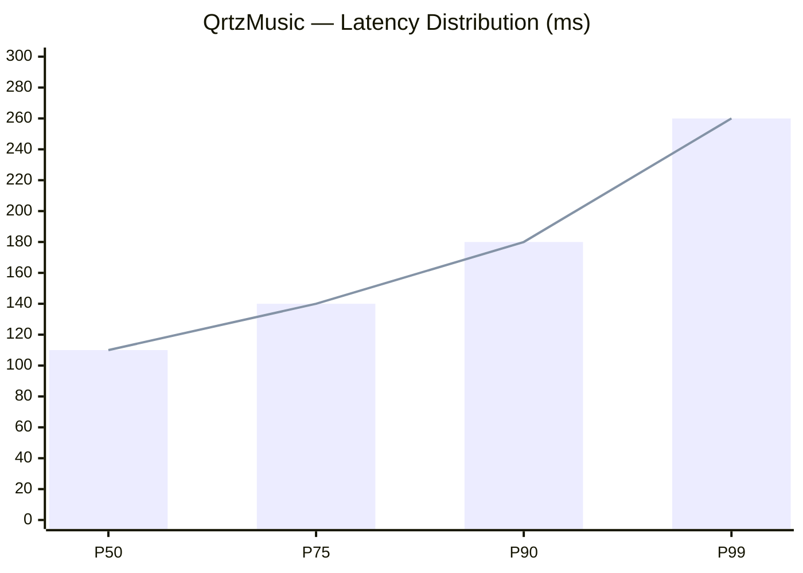

<div align="center">


<br/>


<br/><br/>

<a href="https://github.com/meguminn1">
  
</a>


<br/><br/>

<a href="https://t.me/rynaaqrtz">
  
</a>
&nbsp;
<a href="https://github.com/meguminn1">
  
</a>

<br/><br/>

<!-- NOW STATUS -->

&nbsp;

&nbsp;


</div>


##  &nbsp;`< About Me />`

```typescript
const megumin: Developer = {
  name      : "Megumin",
  role      : "Backend Engineer & System Designer",
  location  : "🌏 Indonesia",

  focus     : [
    "Serverless Architecture",
    "REST & Queue API Design",
    "Clean Code & Maintainability",
  ],

  currently : {
    building : "QrtzMusic — no auth, no DB, fully client-driven 🎧",
    learning : "Advanced Queue Systems with BullMQ + Redis",
    exploring: "Edge Functions & low-latency patterns",
  },

  stack     : {
    backend  : ["Node.js", "TypeScript", "Python", "BullMQ", "Redis"],
    frontend : ["Next.js", "React", "Tailwind CSS"],
    infra    : ["Docker", "Vercel", "Serverless"],
  },

  philosophy: "Build simple. Scale only when needed. Design it right from the start.",
};
```


## 🌸 &nbsp;Philosophy & Principles

<div align="center">

| &nbsp; | Principle | What it means |
|:---:|:---|:---|
| 🧠 | **Think in flows** | Trace the data path, not just the function |
| ⚙️ | **Prefer stateless** | Scalable by design, not by luck |
| ⚡ | **Optimize for latency** | UX is a first-class concern |
| 🧩 | **Single responsibility** | Every component owns exactly one thing |
| 🔒 | **Secure by default** | Auth, rate-limit, validate — always |
| 📦 | **Ship incrementally** | Small, testable, deployable units |

> *"The best system is one you can explain in 5 minutes but runs for 5 years."*

</div>


## 🏗️ &nbsp;System Design — QrtzMusic

<div align="center">


<br/>
<sub><i>🎧 Full Architecture — QrtzMusic &nbsp;|&nbsp; Client-First &nbsp;·&nbsp; Serverless &nbsp;·&nbsp; Zero-Auth</i></sub>

<br/><br/>


<br/>


</div>

<br/>




## 🧠 &nbsp;Tech Stack

<div align="center">

<table>
<tr>
<td align="center" width="33%">

**⚙️ Backend & Runtime**


`Node.js` &nbsp;`TypeScript` &nbsp;`Python` &nbsp;`Docker`

</td>
<td align="center" width="33%">

**🎨 Frontend & Framework**


`Next.js` &nbsp;`React` &nbsp;`Tailwind` &nbsp;`JavaScript`

</td>
<td align="center" width="33%">

**☁️ Infra & Deploy**


`Vercel` &nbsp;`Redis` &nbsp;`BullMQ` &nbsp;`Serverless`

</td>
</tr>
</table>

</div>


## 🚀 &nbsp;Featured Projects

<div align="center">

<table>
<tr>
<td width="50%" valign="top">

### 🎧 QrtzMusic
> *Music platform — no login, no DB, fully client-driven.*


<br/>

- 🔓 Zero-auth architecture
- 💾 Client-side storage only
- 🤖 AI-powered via Kobeni Service
- ⚡ Auto-scaling on Vercel
- 🎵 YouTube API integration

</td>
<td width="50%" valign="top">

### 🌸 Qrtznime
> *UI/UX-focused anime web experience.*


<br/>

- 🎌 Immersive anime browsing UI
- ✨ Smooth UX & micro-animations
- 🧩 Clean component-driven design
- 📱 Mobile-first responsive layout

</td>
</tr>
</table>

</div>


## 🏆 &nbsp;Achievements & Stats

<div align="center">


<br/>


<br/>


<br/>


<br/>


<br/>


</div>


## 🐍 &nbsp;Contribution History

<div align="center">


</div>


## 🌐 &nbsp;Connect With Me

<div align="center">

<br/>

<a href="https://t.me/rynaaqrtz">
  
</a>
&nbsp;&nbsp;
<a href="https://github.com/meguminn1">
  
</a>

<br/><br/>


<br/><br/>


<br/><br/>

<sub>𓂃 ✦ &nbsp; meguminn1 &nbsp; ✦ 𓂃</sub>

</div>


