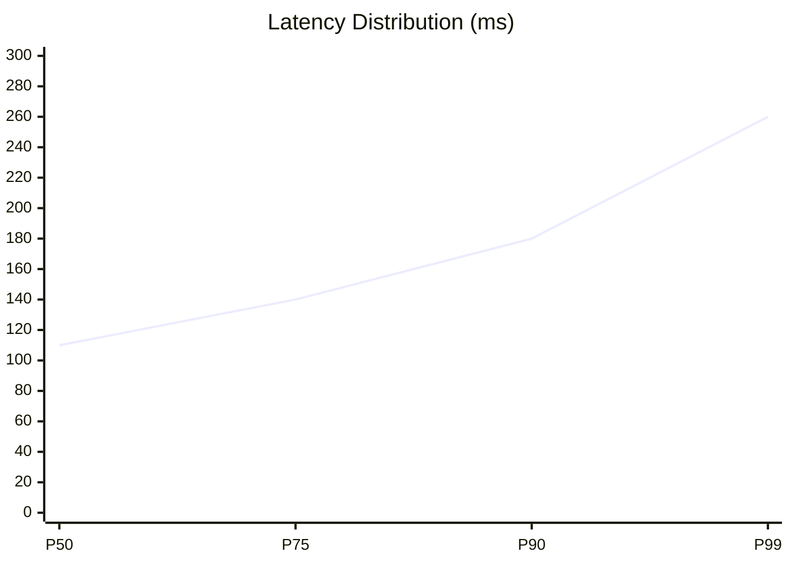

  

  

  

    
    
    
  

---

### 🌸 Philosophy

> «“Build simple systems. Scale only when needed. But design it right from the start.”»

* 🧠 **Think in flows**, not functions
* ⚙️ **Prefer stateless** & scalable systems
* ⚡ **Optimize** for latency & UX
* 🧩 Every component must have **clear responsibility**

---

### 🏗️ System Design — QrtzMusic (Full Architecture)

  
   
  <i>High-Level Architecture for QrtzMusic. Clean, Client-First, and Serverless.</i>

---

### 📊 System Metrics & Performance

  
  
  
   
  
  
  

 

---

### 🏆 Personal Achievements & Stats

---

### 🧠 Tech Stack

### 🚀 Featured Work
 **🎧 QrtzMusic**
   * Music platform tanpa login, tanpa DB, fully client-driven.
 **🌸 Qrtznime**
   **UI/UX-focused anime web experience.**

---

### 🐍 Contribution History

---

### 🌐 Connect

---

<strong>Build simple. Scale smart. Stay reliable.</strong>

𓂃 ✦ meguminn1 ✦ 𓂃

