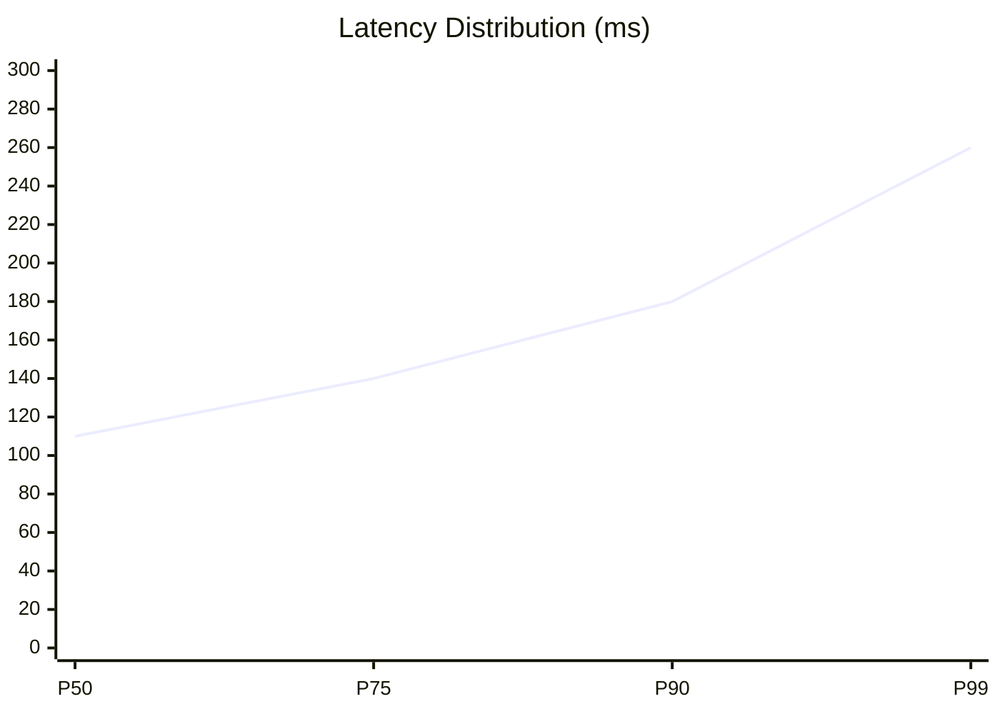

<div align="center">

<!-- Typing Animation - Backend Dev focus -->


<br/>

<!-- Banner -->


<br/>

<!-- Badges -->


</div>

---

<div align="center">

### `< Backend Dev />` — What I Do

</div>

```typescript
const megumin = {
  role      : "Backend Engineer & System Designer",
  focus     : ["Serverless", "API Design", "Clean Architecture"],
  philosophy: "Build simple. Scale smart. Stay reliable.",
  currently : "Building QrtzMusic — no login, no DB, fully client-driven",
  tools     : ["Node.js", "TypeScript", "Next.js", "Docker", "Redis", "BullMQ"],
};
```

---

### 🌸 Philosophy

> *"Build simple systems. Scale only when needed. But design it right from the start."*

| Principle | Description |
|-----------|-------------|
| 🧠 **Think in flows** | Not functions — trace the data, not the code |
| ⚙️ **Prefer stateless** | Scalable by design, not by luck |
| ⚡ **Optimize early** | Latency & UX are first-class concerns |
| 🧩 **Clear responsibility** | Every component owns exactly one thing |

---

### 🏗️ System Design — QrtzMusic (Full Architecture)

<div align="center">
  
  <br/>
  <sub><i>🎧 High-Level Architecture for QrtzMusic — Clean, Client-First, and Serverless.</i></sub>
</div>

---

### 📊 System Metrics & Performance

<div align="center">


<br/>


</div>

<br/>



---

### 🏆 Achievements & Stats

<div align="center">


<br/>


<br/>


<br/>

<!-- Activity Graph -->


</div>

---

### 🧠 Tech Stack

<div align="center">

**Backend & Runtime**
<br/>


**Frontend & Framework**
<br/>


**Infra & Deploy**
<br/>


</div>

---

### 🚀 Featured Work

<table>
<tr>
<td width="50%" valign="top">

### 🎧 QrtzMusic
> *Music platform tanpa login, tanpa DB, fully client-driven.*


- ✅ Zero-auth architecture
- ✅ Client-side storage only
- ✅ AI-powered via Kobeni AI Service
- ✅ Auto-scaling on Vercel
- ✅ YouTube API integration

</td>
<td width="50%" valign="top">

### 🌸 Qrtznime
> *UI/UX-focused anime web experience.*


- ✅ Immersive anime browsing UI
- ✅ Focus on smooth UX & animations
- ✅ Clean, component-driven design

</td>
</tr>
</table>

---

### 🐍 Contribution History

<div align="center">


</div>

---

### 🌐 Connect

<div align="center">

<a href="https://t.me/rynaaqrtz">
  
</a>
<a href="https://github.com/meguminn1">
  
</a>

<br/><br/>


<br/><br/>

---

**`Build simple. Scale smart. Stay reliable.`**

<sub>𓂃 ✦ meguminn1 ✦ 𓂃</sub>

<!-- typing footer -->


</div>
